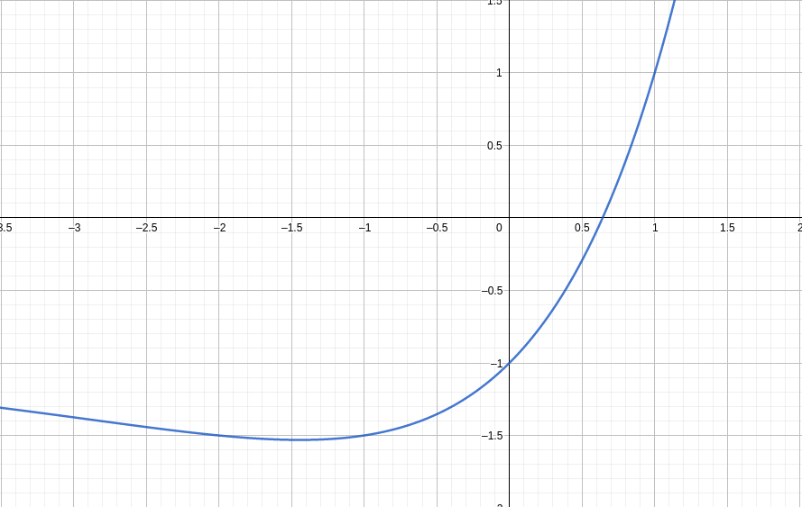
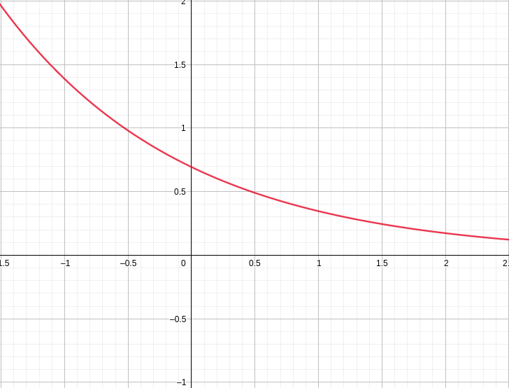

# Лабораторная работа №3

## Задание 1
Условие: $x 2^x = 1$

Локализуем корни уравнения $f(x) = x 2^x - 1$:

Видно что отрезок локализации будет $[0, 1]$

Теперь выберем итерационный процесс. Рассмотрим $x_{n+1} = \frac{1}{2^{x_{n}}}$.
$$\varphi'(x) = \left( \frac{1}{2^x} \right)' = - \frac{ln2}{2^x}$$

Рассмотрим график $|\varphi'(x)| = \frac{ln2}{2^x}$:

Видно что на отрезке локализации $[0, 1]$: $|\varphi'(x)| < 1$. Значит используем этот итерационный процесс.

С помощью этого итерационного процесса корень получился $x \approx 0.64118574450499$. Метод сошелся с заданой точностью $\varepsilon = 10^{-14}$ за 40 итераций.