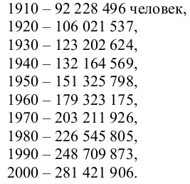
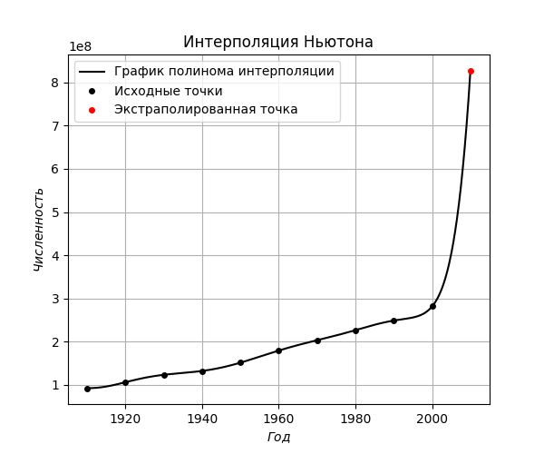
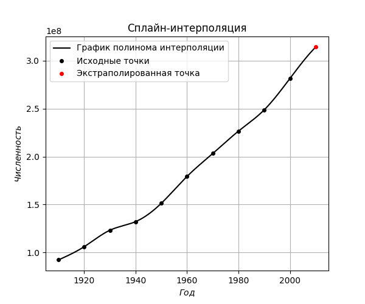

# Лабораторная работа номер 4

## Задание VI.9.32

#### Условие:
Дана перепись населения США:

#### Постоим интерполяцию Ньютона:
Экстраполируем точку в 2010 году и построим график:

Получили, что в 2010 году население составит **827906510** человек. Истинное значение составляет **308745538**. Полученный с помощью экстраполяции результат сильно отличается от истинного значения.

#### Построим сплайн-интерполяцию:

Для интерполяции используем кубический сплайн: $S_k(x) = a_k + b_k (x - x_k) + \frac{c_k}{2} (x - x_k)^2 +  \frac{d_k}{6} (x - x_k)^3$

Построим график найденного сплайна:

Получили, что в 2010 году население составит **314133939** человек. Истинное значение составляет **308745538**. Полученный с помощью экстраполяции результат с достаточной точностью соответствует истинному значению.

#### Вывод

По результатам видно, что сплайн-интерполяция более точно может предсказывать результаты, чем интерполяция Ньютона.