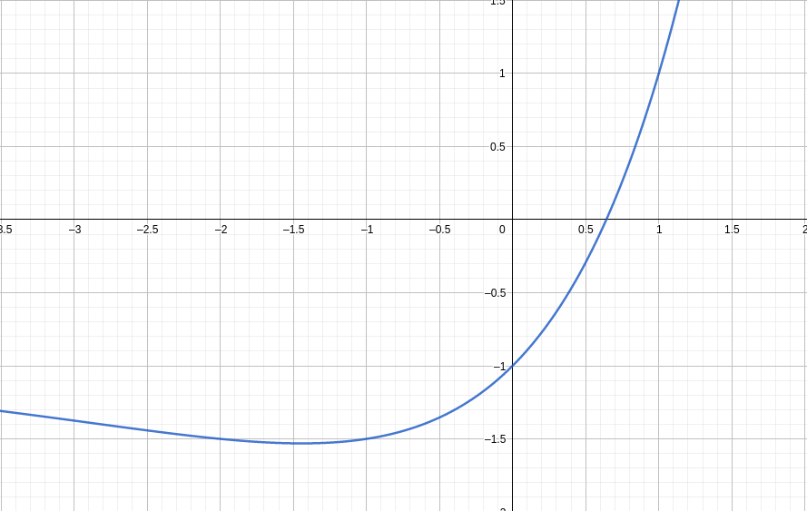
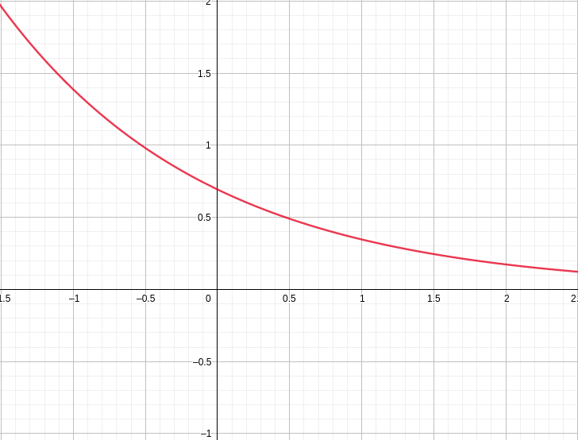
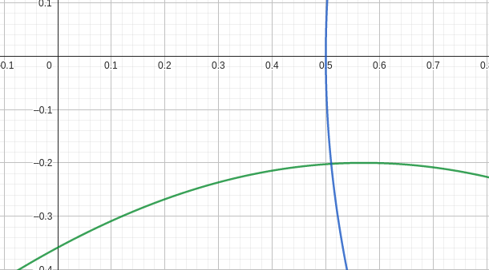

# Лабораторная работа №3

## Задание 1

#### Условие: 

$$x 2^x = 1$$

#### Локализация корней:

Локализуем корни уравнения $f(x) = x 2^x - 1$:

Видно что отрезок локализации будет $[0, 1]$. В качестве начального условия возьмём $x = 1$

#### Выбор итерационного процесса:
Теперь выберем итерационный процесс. Рассмотрим $x_{n+1} = \frac{1}{2^{x_{n}}}$.
$$\varphi'(x) = \left( \frac{1}{2^x} \right)' = - \frac{ln2}{2^x}$$

Рассмотрим график $|\varphi'(x)| = \frac{ln2}{2^x}$:

Видно что на отрезке локализации $[0, 1]$: $|\varphi'(x)| < 1$. Значит используем этот итерационный процесс.

#### Результаты:

С помощью этого итерационного процесса корень получился $x \approx 0.64118574450499$. Метод сошелся с заданой точностью $\varepsilon = 10^{-14}$ за 40 итераций.

## Задание 2

#### Условие:

Вычислить с точностью $\varepsilon = 10^{-3}$ координаты точек пересечения нелинейного уравнения методом Ньютона.

$$\begin{equation*}
    \begin{cases}
        sin(x+1) - y = 1.2\\
        2x + cos(y) = 2
    \end{cases}
\end{equation*}$$

#### Метод решения:
Решать будем методом Нютона: $x_{k + 1} = x_k - J^{-1}F(x_k)$:

- Система:

$$\begin{equation*} 
    \begin{cases}
        F_1(x) = sin(x+1) - y - 1.2\\
        F_2(x) = 2x + cos(y) - 2
    \end{cases}
\end{equation*}$$

- Её якобиан:

$$\begin{equation*}
J = \left(
    \begin{array}{cccc}
        \frac{dF_1}{dx} & \frac{dF_1}{dy}\\
        \frac{dF_2}{dx} & \frac{dF_2}{dy}\\
    \end{array}
    \right) = \left(
        \begin{array}{cccc}
            cos(x + 1) & -1\\
            2          & -sin(y)\\
        \end{array}
        \right)
\end{equation*}$$

#### Локализация корней:

Получается можно взять: $x \in [-1, 1]$ и $y \in [-1, 1]$. В качестве начального условия возьмём $x = 0$ и $y = 0$.

#### Резултаты:

$$\begin{equation*}
    \left(
    \begin{array}{cccc}
        x_0\\
        y_0\\
    \end{array}
    \right) = \left(
        \begin{array}{cccc}
            0.51015016  \\
            -0.20183842 \\
        \end{array}
        \right)
\end{equation*}$$

Метод сошелся с точностью $\varepsilon = 10^{-3}$ за 3 итерации.
